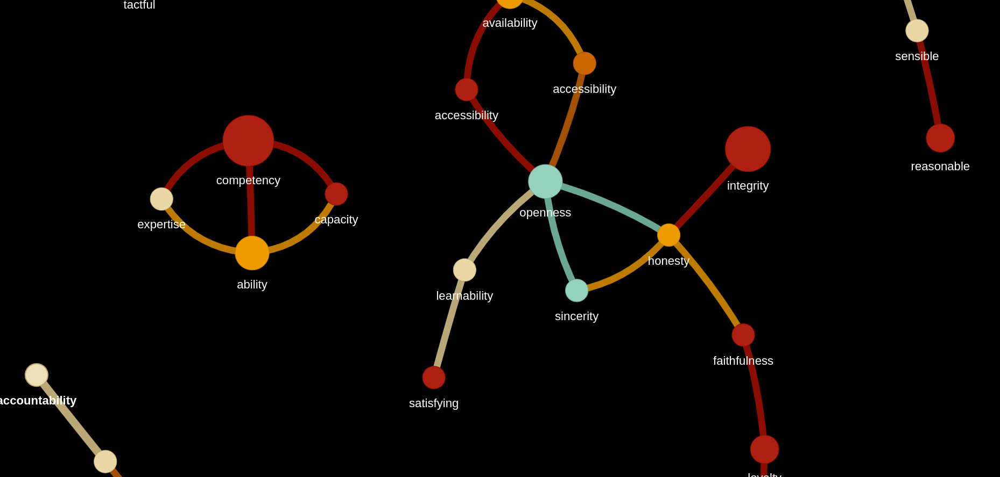

# TAS-Verif

This repository contains work around the verification of autonomous systems:
- Trustworthy Criteria & Literature Review
- Criteria Review Data & Network Graph
- Manuscript for Arxiv and publishing

# Manuscript

Working title:
Challenges to Assessing the Trustworthiness of Autonomous Systems

Overview:
This will be a 2-3 page 'checklist' style paper that will outline the challenges to verifying autonomous systems. The literature review will outline the major trustworthy criteria and these must be filtered and ordered for the particular application based on input from the trust stakeholders. The main part of the paper deals with the assessment of those criteria against the specifications, how this can be achieved, what the metrics are and the standards by which they can be judged. Analysis of the results will allow 'trust engineers' to see where the system may fail to meet minimum standards or where there is a miscalibration to the user requiring corrective action prior to deployment. Operational systems should have some level of runtime monitoring especially if the system is allowed to functionally evolve where human oversight will be neccessary.

# Trust Qualities

A literature review into trustworthy autonomous systems reveals a set of quality requirements that these systems should have for correct and trusted operation. The properties of trust are very broad (we have uncovered over 100) and the relation between the system and the user can be quite complex and as such, we present both the raw and a simplifed version of the results. Grouping and categorising the qualities helps to marshall thoughts on the importance of each criteria, ensure all critical areas are covered and prevent duplicate work.

In the first tab of TrustQualities.xlsx are the qualities listed in each academic study, a node name (if not a positive adjective), a definition of the word and a list of synonyms (used as edges in the network graph). Categories are used to put the qualities into groups. The final column lists objective specifications or regulations that may be used as an assessment reference. The trust_qualities.py script can be used to draw the quality network.

Larger nodes depict quality terms that were referenced with a higher frequency. The links between the nodes are derived from thesaurus synonyms.
